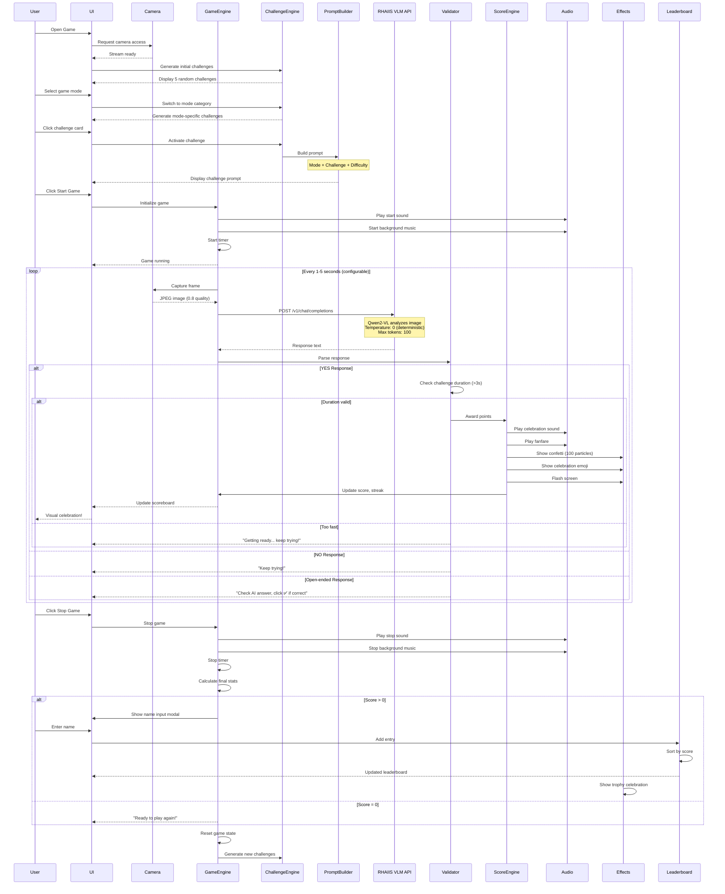
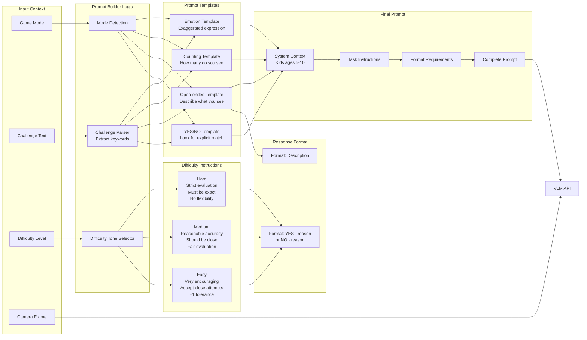
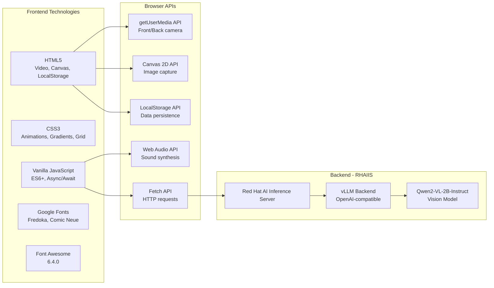

# Red Hat Family Day 2025 - AI Vision Quest Game Architecture

## System Architecture

```mermaid
graph TB
    subgraph "User Interface Layer"
        Header[Header<br/>Red Hat Family Day Branding]
        ScoreBoard[Score Board<br/>Points, Challenges, Streak, Timer]
        VideoFeed[Video Feed<br/>Live Camera Display]
        FlipCamera[Flip Camera Button<br/>Front/Back Toggle]
        Controls[Start/Stop Button<br/>Game Control]
        GameModes[Game Mode Selector<br/>6 Modes in 3x2 Grid]
        ChallengesList[Challenges List<br/>5 Random Challenges]
        CurrentChallenge[Current Challenge Box<br/>Active Challenge Display]
        AIResponse[AI Response Box<br/>Real-time Feedback]
        Settings[Settings Modal<br/>Difficulty & Connection]
        Leaderboard[Leaderboard Modal<br/>Top 10 Players]
    end

    subgraph "Input Layer"
        Camera[Live Camera<br/>Front/Back Camera]
        CameraSwitch[Camera Switch<br/>Toggle facingMode]
        ChallengeSelection[Challenge Selection<br/>User clicks challenge card]
        ManualComplete[Manual Complete Button<br/>Award points manually]
    end

    subgraph "Game Engine Core"
        GameState[Game State Manager<br/>Score, Streak, Timer, Mode]
        ChallengeEngine[Challenge Engine<br/>6 Categories × 12 Challenges]
        ScoreEngine[Score Engine<br/>Points, Streak, Completion]
        TimerEngine[Timer Engine<br/>Game Duration Tracking]
        ValidationEngine[Validation Engine<br/>Min 3s challenge duration]
    end

    subgraph "Challenge Categories"
        Scavenger[Scavenger Hunt<br/>Find objects 18 challenges]
        Emotions[Emotions & Faces<br/>Make expressions 12 challenges]
        Colors[Colors<br/>Identify colors 12 challenges]
        Counting[Counting<br/>Show quantities 10 challenges]
        Actions[Actions<br/>Perform actions 12 challenges]
        BodyParts[Body Parts<br/>Show body parts 12 challenges]
    end

    subgraph "AI/ML Layer - RHAIIS"
        VLM_API[VLM API Endpoint<br/>RHAIIS vLLM Server<br/>Port 8000]
        VLM_Model[Qwen2-VL-2B-Instruct<br/>Vision Language Model]
        VLM_Inference[Inference Engine<br/>Temperature: 0 for YES/NO<br/>Max tokens: 100]
        VLM_Response[Response Parser<br/>YES/NO Detection]
    end

    subgraph "Prompt Engineering Layer"
        PromptBuilder[Dynamic Prompt Builder<br/>Mode + Challenge + Difficulty]
        DifficultyModifier[Difficulty Modifier<br/>Easy/Medium/Hard Instructions]
        ResponseFormat[Response Format Handler<br/>YES/NO vs Open-ended]
        ValidationLogic[Validation Logic<br/>Pattern matching for YES]
    end

    subgraph "Audio System"
        SoundFX[Sound Effects<br/>Web Audio API]
        BackgroundMusic[Background Music<br/>Twinkle Twinkle melody]
        CelebrationMusic[Celebration Fanfare<br/>Triumph sound]
        MusicToggle[Music Toggle<br/>Enable/Disable]
    end

    subgraph "Data Persistence Layer"
        LocalStorage[Browser LocalStorage]
        LeaderboardData[Leaderboard Data<br/>Top scores JSON]
        MusicPrefs[Music Preferences<br/>Enabled/Disabled]
        ThemePrefs[Theme Preferences<br/>Light/Dark]
    end

    subgraph "Visual Effects Layer"
        Confetti[Confetti System<br/>100 particles on success]
        Celebration[Celebration Overlay<br/>Emoji animation]
        Flash[Success Flash<br/>Green screen flash]
        Animations[CSS Animations<br/>Bounce, pulse, fade]
    end

    subgraph "Modal System"
        NameModal[Name Input Modal<br/>Add to leaderboard]
        PasswordModal[Admin Password Modal<br/>Clear leaderboard]
        ChallengePromptModal[Challenge Prompt Modal<br/>Select challenge reminder]
        GenericModal[Generic Modal<br/>Messages & alerts]
    end

    %% User Interactions
    Header --> Settings
    ScoreBoard --> GameState
    VideoFeed --> Camera
    FlipCamera --> CameraSwitch
    Controls --> GameEngine
    GameModes --> ChallengeEngine
    ChallengesList --> ChallengeSelection
    CurrentChallenge --> VLM_API
    ManualComplete --> ScoreEngine

    %% Camera Flow
    Camera --> VideoFeed
    CameraSwitch --> Camera

    %% Challenge Flow
    ChallengeSelection --> PromptBuilder
    PromptBuilder --> DifficultyModifier
    DifficultyModifier --> ResponseFormat
    ResponseFormat --> VLM_API

    %% Game Engine Flow
    GameEngine --> GameState
    GameEngine --> ChallengeEngine
    GameEngine --> ScoreEngine
    GameEngine --> TimerEngine
    GameEngine --> ValidationEngine

    %% Challenge Categories
    ChallengeEngine --> Scavenger
    ChallengeEngine --> Emotions
    ChallengeEngine --> Colors
    ChallengeEngine --> Counting
    ChallengeEngine --> Actions
    ChallengeEngine --> BodyParts

    %% VLM Processing
    VLM_API --> VLM_Model
    VLM_Model --> VLM_Inference
    VLM_Inference --> VLM_Response
    VLM_Response --> ValidationLogic
    ValidationLogic --> ScoreEngine

    %% Scoring & Effects
    ScoreEngine --> SoundFX
    ScoreEngine --> CelebrationMusic
    ScoreEngine --> Confetti
    ScoreEngine --> Celebration
    ScoreEngine --> Flash
    ScoreEngine --> GameState

    %% Audio System
    GameEngine --> BackgroundMusic
    MusicToggle --> BackgroundMusic
    MusicToggle --> CelebrationMusic
    MusicToggle --> SoundFX

    %% Data Persistence
    ScoreEngine --> LeaderboardData
    LeaderboardData --> LocalStorage
    MusicToggle --> MusicPrefs
    MusicPrefs --> LocalStorage
    Settings --> ThemePrefs
    ThemePrefs --> LocalStorage

    %% Leaderboard
    LeaderboardData --> Leaderboard
    GameState --> NameModal
    NameModal --> LeaderboardData
    PasswordModal --> LeaderboardData

    %% Modal System
    GameEngine --> NameModal
    GameEngine --> ChallengePromptModal
    Settings --> PasswordModal

    %% Display Updates
    GameState --> ScoreBoard
    VLM_Response --> AIResponse
    Leaderboard --> LocalStorage

    style VLM_API fill:#dc2626,color:#fff
    style VLM_Model fill:#dc2626,color:#fff
    style GameEngine fill:#ff6b9d,color:#fff
    style ScoreEngine fill:#fbbf24,color:#000
    style ChallengeEngine fill:#10b981,color:#fff
    style BackgroundMusic fill:#c084fc,color:#fff
```



## Game Flow Sequence



## Challenge Prompt Engineering Strategy



## Component Details

### 1. **Game Modes & Challenges**

| Mode | Challenges | Points Range | Difficulty Distribution |
|------|-----------|--------------|------------------------|
| Scavenger Hunt | 18 | 10-25 | 11 Easy, 6 Medium, 1 Hard |
| Emotions | 12 | 25-35 | 0 Easy, 6 Medium, 6 Hard |
| Colors | 12 | 10-30 | 10 Easy, 1 Medium, 1 Hard |
| Counting | 10 | 10-35 | 4 Easy, 4 Medium, 2 Hard |
| Actions | 12 | 10-25 | 7 Easy, 5 Medium, 0 Hard |
| Body Parts | 12 | 10-20 | 8 Easy, 4 Medium, 0 Hard |

**Total: 76 unique challenges**

### 2. **VLM Integration (RHAIIS)**
- **Endpoint**: `https://rhaiis-route-rhaiis.apps.sno.sandbox73.opentlc.com`
- **Model**: Qwen2-VL-2B-Instruct (Vision Language Model)
- **API**: OpenAI-compatible chat completions endpoint
- **Request Interval**: 1-5 seconds (configurable)
- **Timeout**: 30 seconds per request
- **Temperature**: 0 (deterministic for YES/NO consistency)
- **Max Tokens**: 100 (short, focused responses)
- **Image Format**: JPEG, 0.8 quality

### 3. **Response Validation Engine**

**YES Detection Patterns:**
```javascript
// Primary: Explicit YES
/^yes\b/i                    // Starts with YES
/^yes\s*-/i                  // YES - format
/^yes\s*,/i                  // YES, format

// Fallback: Affirmative inference
/(i see|i can see|there is|there are)/i
/(holding|showing|displaying|presenting)/i
/(visible|present|appears|looks like)/i
/person\s+(?:is|with|holding)/i

// Override: Negative keywords
/(no|not|don't|cannot|can't|do not)/i  // Force NO
```

### 4. **Scoring System**
- **Points**: Challenge-specific (10-35 per challenge)
- **Streak**: Consecutive successful challenges
- **Completion Tracking**: Unique challenge IDs prevent duplicate completions
- **Validation**: Minimum 3-second duration to prevent instant wins
- **Manual Override**: Green button for open-ended challenges or edge cases

### 5. **Audio System - Web Audio API**

**Sound Effects:**
- **Success**: Ascending chime (C5 → E5 → G5)
- **Select**: Quick click (800 Hz)
- **Start**: Upbeat start (G4 → C5)
- **Stop**: Descending (C5 → G4)
- **Error**: Buzz (200 Hz sawtooth)
- **Celebration**: Multi-note cascade (C5, E5, G5, C6)

**Background Music:**
- **Melody**: "Twinkle Twinkle Little Star" (familiar, kid-friendly)
- **Duration**: ~15 seconds per loop with 1.5s pause
- **Volume**: 15% (gentle background)
- **Loop**: Continuous until game stops

**Celebration Fanfare:**
- **Notes**: C5 → E5 → G5 → C6 → G5 → C6
- **Volume**: 30% (louder than background)
- **Duration**: 2 seconds

### 6. **Visual Effects System**

**Confetti Animation:**
- **Count**: 100 particles per success
- **Colors**: 7 vibrant colors (pink, purple, blue, yellow, green, orange, magenta)
- **Timing**: Staggered release (20ms between particles)
- **Physics**: Random size (10-20px), varied fall speed (1.5-3.5s)
- **Rotation**: 720° rotation during fall

**Celebration Emoji:**
- **Duration**: 1.5 seconds
- **Animation**: Scale and rotate entrance/exit
- **Position**: Center screen
- **Shadow**: Multi-layer glow effect

**Success Flash:**
- **Color**: Green radial gradient
- **Duration**: 0.6 seconds
- **Opacity**: Fade in (30%) then out
- **Coverage**: Full screen overlay

### 7. **Leaderboard System**
- **Storage**: Browser localStorage
- **Capacity**: Top 10 displayed (unlimited stored)
- **Sorting**: By score (highest first)
- **Data**: Name, score, challenges completed, streak, time, date
- **Medals**: 🥇 Gold, 🥈 Silver, 🥉 Bronze
- **Protection**: Password-protected clear (password: "2025")

### 8. **Settings & Configuration**

**Difficulty Levels:**
- **Easy**: Very encouraging, ±1 tolerance, accept close attempts
- **Medium**: Reasonable accuracy, should be close, fair evaluation
- **Hard**: Strict, must be exact, no flexibility

**Request Interval:**
- **Options**: 1s, 2s, 3s, 5s
- **Default**: 1 second
- **Purpose**: Balance between responsiveness and API load

**VLM Endpoint:**
- **Default**: External route (recommended)
- **Custom**: User-provided endpoint with model selection
- **API Key**: Optional for custom endpoints
- **Connection Test**: Built-in validation before playing

## Technology Stack



## Key Features

### 1. **Multi-Mode Gameplay**
- 6 distinct game modes with unique challenges
- 3x2 grid layout for easy mode switching
- 5 random challenges per mode
- Color-coded difficulty badges

### 2. **Smart AI Validation**
- Deterministic YES/NO detection (temperature: 0)
- Fallback inference from descriptions
- Negative keyword override
- Duration validation (3-second minimum)

### 3. **Kid-Friendly Design**
- Cartoon-style UI with vibrant colors
- Fredoka & Comic Neue fonts
- Bouncing animations everywhere
- Encouraging feedback messages
- Red Hat Family Day branding

### 4. **Audio Experience**
- 6 distinct sound effects
- Looping background music
- Celebration fanfare
- Music toggle with persistence
- Web Audio API synthesis

### 5. **Visual Celebrations**
- 100-particle confetti system
- Full-screen emoji animation
- Success screen flash
- Pulsing buttons
- Shimmer effects

### 6. **Competitive Elements**
- Real-time scoreboard
- Streak tracking
- Game timer
- Leaderboard with top 10
- Medal system (🥇🥈🥉)

### 7. **Accessibility Features**
- Keyboard shortcuts (Space = Start/Stop, ESC = Close modals)
- Front/back camera toggle
- Manual point award button
- Dark mode support
- Clear visual feedback

### 8. **Challenge Tracking**
- Unique challenge IDs
- Completion state persistence
- Visual completed indicator (✅)
- Prevent duplicate completions
- Auto-refresh on mode switch

## Performance Considerations

- **Image Capture**: JPEG 0.8 quality (balance size/quality)
- **Request Throttling**: Configurable 1-5s intervals
- **Timeout Protection**: 30s timeout per VLM request
- **Audio Efficiency**: Reused AudioContext, scheduled oscillators
- **Animation Optimization**: CSS transforms, requestAnimationFrame
- **Memory Management**: Cleanup on page unload
- **Confetti Cleanup**: Auto-remove after 4 seconds
- **Modal Lazy Loading**: Only render when opened

## User Flow Examples

### Example 1: First-Time Player
```
1. Open game → Camera permission requested
2. See default "Scavenger Hunt" mode
3. Browse 5 challenges, click one (e.g., "Show me a book!")
4. Click "Start Game" → Background music starts
5. Hold book to camera → AI analyzes every 1 second
6. AI says "YES" → 🎉 15 points! Confetti! Music!
7. Pick another challenge → Keep playing
8. Click "Stop Game" → Enter name for leaderboard
9. See final score & ranking → Play again!
```

### Example 2: Emotions Mode Challenge
```
1. Click "😊 Emotions" mode button
2. See funny challenges: "Make the funniest silly face ever!"
3. Click challenge → Shows active (green border)
4. Read AI prompt: "Look for VERY silly or funny face"
5. Start game → Make exaggerated silly face
6. AI says "YES - I can see a very silly face with ..." → 25 points!
7. Challenge marked completed (✅) and grayed out
8. Pick another emotion challenge
```

### Example 3: Manual Completion (Open-ended)
```
1. Colors mode → "What colors do you see in this image?"
2. Click challenge → Note: Manual button appears pulsing
3. Start game → Show colorful objects
4. AI responds: "I see red, blue, yellow, and green colors"
5. User checks: "Yes, that's correct!"
6. Click green "✅ Click Here to Award Points!" button
7. 15 points awarded → Success celebration
```

## Security & Privacy

- **Camera Access**: User-controlled, can be denied
- **Local Processing**: Images sent to RHAIIS, not stored
- **Data Storage**: Leaderboard stored locally (not cloud)
- **XSS Protection**: Input sanitization on leaderboard names
- **Password Protection**: Admin features require password
- **No Tracking**: No analytics or external data collection
- **Secure Communication**: HTTPS required for camera API

## Configuration Files

None required - single standalone HTML file with inline CSS/JS!

## Browser Compatibility

- **Chrome/Edge**: Full support ✅
- **Firefox**: Full support ✅
- **Safari**: Full support ✅ (iOS requires HTTPS)
- **Mobile**: Responsive design, optimized for iPad landscape
- **Requirements**: ES6+, Web Audio API, getUserMedia, LocalStorage

## Deployment

Simple static file deployment:
1. Copy `game.html` to web server
2. Serve over HTTPS (required for camera)
3. Configure RHAIIS vLLM endpoint
4. No build process needed!

Alternatively, run locally:
```bash
python3 -m http.server 8080
# Open https://localhost:8080/game.html
```

## Future Enhancements

- [ ] Multiplayer mode (real-time sync)
- [ ] More game modes (animals, shapes, sounds)
- [ ] Achievement system
- [ ] Daily challenges
- [ ] Global leaderboard (backend required)
- [ ] Challenge creator (custom challenges)
- [ ] Photo gallery (save best moments)
- [ ] Share score on social media

