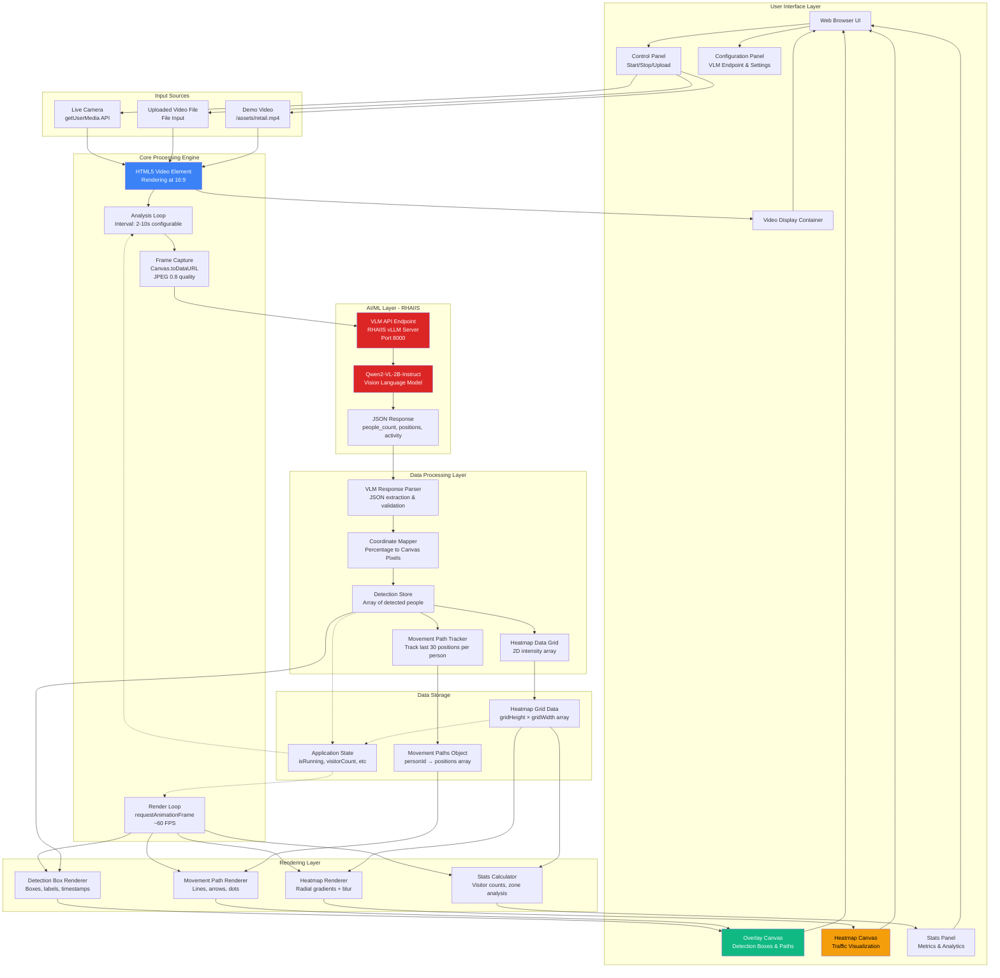
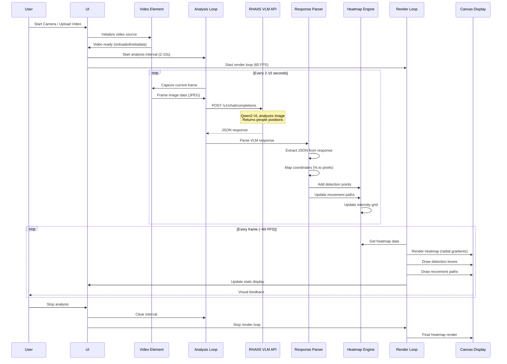
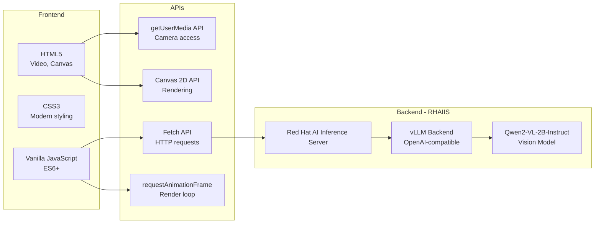

# Smart Retail Analytics - Architecture Diagram

## System Architecture

## Data Flow Sequence

## Component Details

### 1. **Video Input Processing**
- Supports 3 input modes: live camera, uploaded video, demo video
- Video rendered at 16:9 aspect ratio
- Camera resolution: 1280x720 (ideal)
- Frame capture uses canvas to extract JPEG at 0.8 quality

### 2. **VLM Integration (RHAIIS)**
- **Endpoint**: `https://rhaiis-route-rhaiis.apps.sno.sandbox73.opentlc.com`
- **Model**: Qwen2-VL-2B-Instruct (Vision Language Model)
- **API**: OpenAI-compatible chat completions endpoint
- **Timeout**: 120 seconds (2 minutes)
- **Request**: Includes text prompt + base64 JPEG image
- **Response**: JSON with people_count, positions (x%, y%), and activity

### 3. **Detection Processing**
- Parses VLM JSON response (handles truncated responses)
- Converts percentage positions (0-100%) to canvas pixels
- Auto-detects normalized (0-1) vs percentage (0-100) formats
- Tracks each person with unique ID
- Stores timestamp for age calculation

### 4. **Movement Tracking**
- Maintains path history per person ID
- Stores last 30 positions per person
- Each position includes: x, y, timestamp
- Paths rendered with colored lines and arrows
- Fade effect based on position age (10 second fade)

### 5. **Heatmap Rendering**
- Grid-based intensity accumulation (10px grid cells)
- Radial gradient rendering for smooth appearance
- 5-color gradient: Blue → Cyan → Green → Yellow → Red
- Blur filter (20px) for professional look
- Configurable radius (20-100px)

### 6. **Detection Overlay**
- Bounding boxes around detected people
- Fresh detections (<3s): Red with "LIVE" badge
- Old detections (>3s): Gray with age timestamp
- Shows: Person ID, coordinates, activity, age
- Pulsing animation on fresh detections

### 7. **Statistics & Analytics**
- **Current Visitors**: Active people count
- **Total Visitors**: Peak occupancy (max seen at once)
- **Avg Dwell Time**: Simulated (20-50s)
- **Zone Analysis**: Hot/Warm/Cool/Cold percentages
- **Activity Log**: Timestamped event history

## Technology Stack

## Key Features

1. **Real-time Analysis**: VLM processes frames every 2-10 seconds (configurable)
2. **Smooth Visualization**: 60 FPS render loop for fluid animations
3. **Movement Tracking**: Color-coded paths showing customer journey
4. **Heat Mapping**: Accumulated traffic intensity with smooth gradients
5. **Age Indicators**: Shows freshness of detections (LIVE vs X seconds ago)
6. **Responsive Design**: Adapts to window resize with canvas reinitialization
7. **Demo Mode**: Pre-loaded retail video for instant demonstration
8. **Progress Tracking**: Visual feedback for video/camera analysis
9. **Error Handling**: Graceful fallbacks for parsing/connection errors
10. **Security**: HTML escaping for XSS prevention in VLM responses

## Performance Considerations

- **Canvas DPI Scaling**: Handles high-DPI displays (retina, 4K)
- **Offscreen Rendering**: Uses offscreen canvas for heatmap composition
- **Blur Optimization**: Filter applied during final compositing
- **Grid Optimization**: 10px grid cells for efficient data structure
- **Path Limiting**: Max 30 positions per person to prevent memory bloat
- **Activity Log Limiting**: Max 10 log entries displayed

## Configuration Options

- **Analysis Interval**: 1-10 seconds between VLM API calls
- **Heatmap Radius**: 20-100px for heat point spread
- **Show Detection Boxes**: Toggle bounding boxes on/off
- **Show Movement Paths**: Toggle path visualization on/off
- **Toggle Overlay**: Hide all overlays (boxes + paths)
- **Toggle Heatmap**: Show/hide heatmap canvas
- **VLM Endpoint**: Default RHAIIS route or custom endpoint
- **Custom Models**: Fetch and select available models from endpoint

