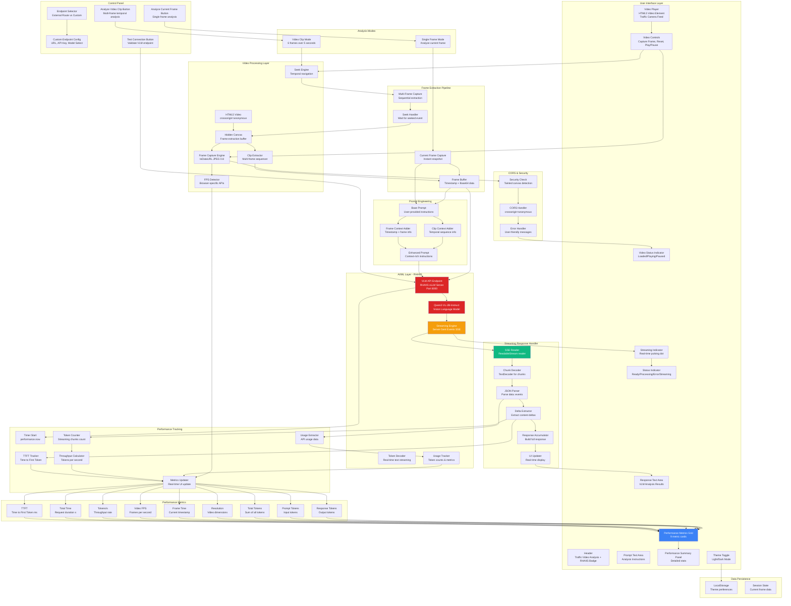
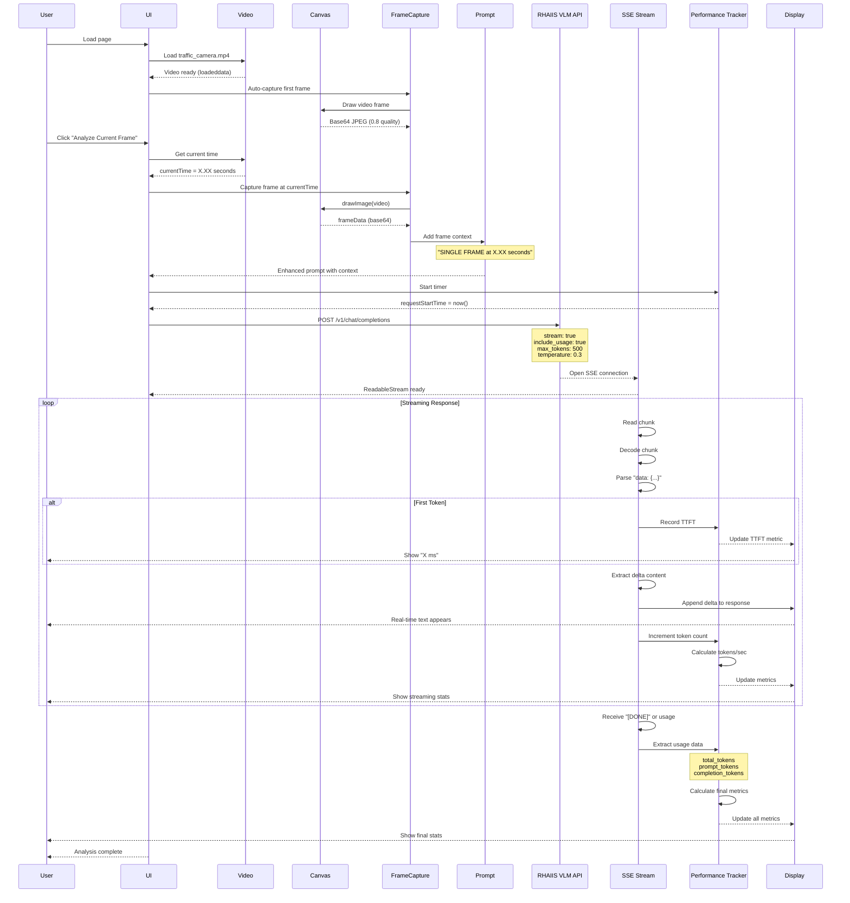
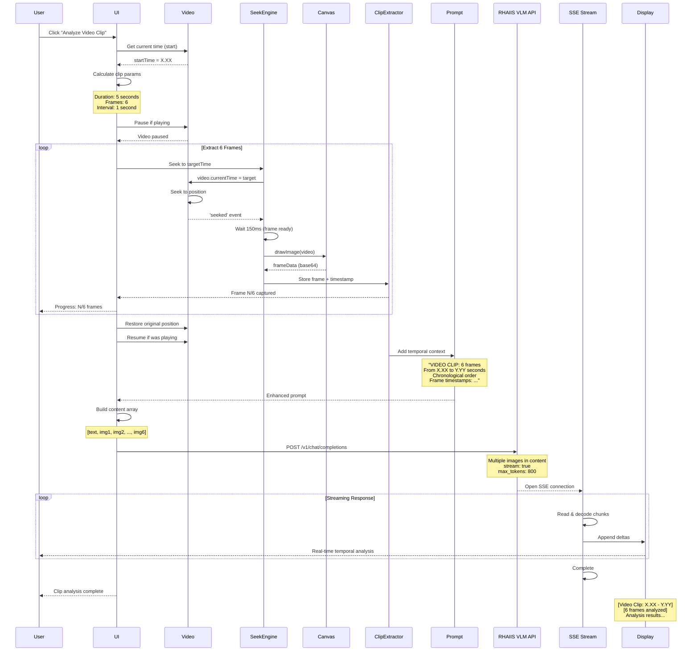
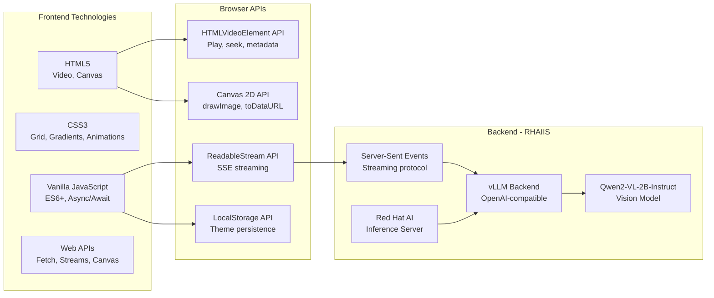

# Traffic Video Analysis - RHAIIS Architecture

## System Architecture



## Data Flow Sequence - Single Frame Analysis



## Data Flow Sequence - Video Clip Analysis



## Streaming Response Architecture

```mermaid
graph LR
    subgraph "VLM Server Response"
        SSE_Start[SSE Stream Start<br/>HTTP 200]
        SSE_Header[Content-Type:<br/>text/event-stream]
        SSE_Data[data: JSON chunks]
        SSE_Done[data: DONE]
    end
    
    subgraph "Client-Side Streaming Handler"
        Reader[ReadableStream<br/>Reader]
        Buffer[Chunk Buffer<br/>TextDecoder]
        LineParser[Line Parser<br/>Split by newline]
        EventFilter[Event Filter<br/>data: prefix]
    end
    
    subgraph "Chunk Processing"
        JSONParse[JSON Parse<br/>Parse each chunk]
        DeltaCheck[Delta Check<br/>choices[0].delta.content]
        UsageCheck[Usage Check<br/>usage object]
        DoneCheck[Done Check<br/>DONE signal]
    end
    
    subgraph "Real-Time Updates"
        ResponseBuilder[Response Builder<br/>Accumulate deltas]
        TokenTracker[Token Tracker<br/>Count chunks]
        TTFTRecord[TTFT Recorder<br/>First token time]
        MetricsCalc[Metrics Calculator<br/>Throughput, elapsed]
    end
    
    subgraph "UI Updates"
        TextArea[Response Text Area<br/>Show partial response]
        StreamingBadge[Streaming Badge<br/>Pulsing indicator]
        MetricCards[Metric Cards<br/>Real-time stats]
        SummaryPanel[Summary Panel<br/>Detailed metrics]
    end
    
    SSE_Start --> Reader
    SSE_Header --> Reader
    SSE_Data --> Reader
    SSE_Done --> Reader
    
    Reader --> Buffer
    Buffer --> LineParser
    LineParser --> EventFilter
    
    EventFilter --> JSONParse
    JSONParse --> DeltaCheck
    JSONParse --> UsageCheck
    JSONParse --> DoneCheck
    
    DeltaCheck --> ResponseBuilder
    DeltaCheck --> TokenTracker
    TokenTracker --> TTFTRecord
    TokenTracker --> MetricsCalc
    UsageCheck --> MetricsCalc
    
    ResponseBuilder --> TextArea
    TokenTracker --> StreamingBadge
    MetricsCalc --> MetricCards
    MetricsCalc --> SummaryPanel
    
    style SSE_Data fill:#10b981,color:#fff
    style ResponseBuilder fill:#f59e0b,color:#fff
    style MetricsCalc fill:#3b82f6,color:#fff
```

## Component Details

### 1. **Video Processing System**

**Frame Capture:**
- **Technology**: HTML5 Canvas API
- **Format**: JPEG, 0.8 quality (balance size/quality)
- **Method**: `canvas.toDataURL('image/jpeg', 0.8)`
- **Trigger**: Manual (button click), Auto (video events)
- **CORS**: Requires `crossorigin="anonymous"` attribute

**FPS Detection:**
```javascript
// Browser-specific APIs
- Firefox: mozDecodedFrames / currentTime
- Chrome/Safari: webkitDecodedFrameCount / currentTime
- Fallback: 30 FPS (default assumption)
```

**Video Clip Extraction:**
- **Duration**: 5 seconds
- **Frame Count**: 6 frames
- **Interval**: ~1 second between frames
- **Method**: Seek + wait for `seeked` event + 150ms buffer
- **Restore**: Original position after extraction

### 2. **RHAIIS VLM Integration**

**Endpoint Configuration:**
- **Default**: `https://rhaiis-route-rhaiis.apps.sno.sandbox73.opentlc.com`
- **Custom**: User-provided endpoint with model selection
- **Model**: Qwen2-VL-2B-Instruct (default)
- **API**: OpenAI-compatible `/v1/chat/completions`
- **Port**: 8000

**Request Parameters:**

| Parameter | Single Frame | Video Clip | Purpose |
|-----------|--------------|------------|---------|
| model | Qwen/Qwen2-VL-2B-Instruct | Same | VLM model ID |
| max_tokens | 500 | 800 | Response length |
| temperature | 0.3 | 0.3 | Creativity level |
| stream | true | true | Enable SSE streaming |
| stream_options | include_usage: true | Same | Get token counts |
| timeout | 60s | 120s | Request timeout |

### 3. **Streaming Response System**

**Server-Sent Events (SSE) Format:**
```
data: {"id":"chatcmpl-xyz","choices":[{"index":0,"delta":{"content":"token"},"finish_reason":null}]}

data: {"id":"chatcmpl-xyz","choices":[{"index":0,"delta":{"content":" next"},"finish_reason":null}]}

data: {"id":"chatcmpl-xyz","choices":[{"index":0,"delta":{},"finish_reason":"stop"}],"usage":{"prompt_tokens":150,"completion_tokens":75,"total_tokens":225}}

data: [DONE]
```

**Streaming Workflow:**
1. Open ReadableStream from fetch response
2. Create TextDecoder for UTF-8 decoding
3. Read chunks in loop until done
4. Decode each chunk and split by newlines
5. Filter lines starting with `data: `
6. Parse JSON from each data line
7. Extract content delta from `choices[0].delta.content`
8. Accumulate deltas to build full response
9. Update UI in real-time with each delta
10. Extract usage data when available
11. Complete when `[DONE]` received or stream ends

**Real-Time Metrics:**
- **TTFT (Time to First Token)**: Time from request start to first content delta
- **Token Count**: Number of streaming chunks received
- **Elapsed Time**: Continuously updated during streaming
- **Tokens/Second**: Real-time throughput calculation

### 4. **Performance Metrics System**

**Tracked Metrics:**

| Metric | Description | Source | Display Format |
|--------|-------------|--------|----------------|
| TTFT | Time to First Token | First delta timestamp | X ms |
| Total Time | Full request duration | Request start to end | X.XX s |
| Tokens/s | Throughput rate | completion_tokens / duration | X.XX |
| Video FPS | Frames per second | Browser video APIs | X.XX |
| Frame Time | Current timestamp | video.currentTime | X.XX s |
| Resolution | Video dimensions | videoWidth × videoHeight | 1920x1080 |
| Total Tokens | Sum of all tokens | usage.total_tokens | NNN |
| Prompt Tokens | Input tokens | usage.prompt_tokens | NNN |
| Response Tokens | Output tokens | usage.completion_tokens | NNN |

**Metrics Update Flow:**
```
Streaming Start → Reset metrics
First Delta → Record TTFT → Update UI
Each Delta → Increment count → Calculate throughput → Update UI
Stream End → Extract usage → Final calculation → Update UI
```

### 5. **Prompt Engineering Strategy**

**Single Frame Prompt:**
```
{user_prompt}

Note: This is a SINGLE FRAME captured at timestamp X.XX seconds. 
Analyze only what is visible in this one frame.
```

**Video Clip Prompt:**
```
{user_prompt}

Note: You are analyzing a VIDEO CLIP (sequence of 6 frames) 
from X.XX to Y.YY seconds. The frames are provided in 
chronological order: Frame 1: A.AA s, Frame 2: B.BB s, ...
Analyze the temporal progression and identify events 
with their timestamps.
```

**Default Prompt:**
> "You are an intelligent traffic monitoring system. Analyze the provided image(s) where each vehicle is overlaid with an ID. Identify and describe all traffic-related events, including timestamps and vehicle IDs when applicable."

### 6. **CORS & Security Handling**

**CORS Requirements:**
- Video must have `crossorigin="anonymous"` attribute
- Video source must support CORS headers
- Canvas becomes "tainted" without proper CORS

**Security Error Handling:**
```javascript
catch (SecurityError) {
  // Detailed user guidance:
  1. Serve through web server (not file://)
  2. Use: python3 -m http.server 8000
  3. Or: npx serve .
  4. Chrome: --allow-file-access-from-files flag
  5. Deploy to proper web server
}
```

**Error Detection:**
- Check `video.videoWidth` and `video.videoHeight`
- Check `video.readyState >= 2`
- Try-catch around `canvas.toDataURL()`
- Display user-friendly error messages

### 7. **UI State Management**

**Status States:**
- **Ready**: Green, ready to analyze
- **Processing**: Yellow, pulsing animation
- **Streaming**: Blue, with streaming indicator
- **Error**: Red, with error details

**Video Status States:**
- **Video ready**: Loaded and ready
- **Frame captured @ X.XXs**: Capture successful
- **Video playing**: Currently playing
- **Video paused**: Paused state
- **CORS/Security Error**: Capture failed

**Button States:**
- **Normal**: `<i class="fas fa-camera"></i> Analyze Current Frame`
- **Processing**: `<span class="spinner"></span> Streaming...`
- **Disabled**: During analysis

### 8. **Keyboard Shortcuts**

| Key | Action | Context |
|-----|--------|---------|
| Ctrl+Enter | Analyze frame | When frame button enabled |
| Space | Play/Pause video | When not in input field |
| Arrow Keys | Seek video | Native video controls |

## Technology Stack



## Key Features

### 1. **Real-Time Streaming**
- Server-Sent Events (SSE) protocol
- Token-by-token response display
- Live performance metrics
- Streaming indicator with pulsing dot
- No waiting for full response

### 2. **Dual Analysis Modes**
- **Single Frame**: Instant snapshot analysis
- **Video Clip**: Temporal sequence analysis (6 frames over 5 seconds)
- Automatic frame context injection
- Timestamp-aware prompts

### 3. **Comprehensive Metrics**
- Time to First Token (TTFT) - Latency indicator
- Total request time - End-to-end duration
- Tokens per second - Throughput rate
- Video FPS - Source video frame rate
- Frame timestamp - Temporal position
- Resolution - Video dimensions
- Token counts - Usage statistics

### 4. **Smart Frame Capture**
- Auto-capture on video load
- Auto-capture on seek events
- Manual capture button
- CORS-aware error handling
- Security error guidance

### 5. **Temporal Analysis**
- Multi-frame sequence extraction
- Seek engine with event waiting
- Chronological frame ordering
- Timestamp preservation
- Temporal prompt enhancement

### 6. **User Experience**
- Real-time streaming feedback
- Live metrics updates
- Keyboard shortcuts
- Dark mode support
- Responsive grid layout
- Status indicators
- Error messages with solutions

### 7. **Enterprise Features**
- RHAIIS branding
- Custom endpoint configuration
- Model selection
- API key support
- Connection testing
- Performance monitoring

## Performance Considerations

### Optimization Strategies

**Frame Capture:**
- JPEG compression (0.8 quality) reduces payload size
- Single canvas reuse (no memory leak)
- Async frame extraction with proper waiting
- 150ms buffer after seek for frame stability

**Network:**
- Streaming reduces perceived latency
- 60s timeout for single frame
- 120s timeout for video clip (6 frames)
- Abort controller for timeout handling
- CORS preflight optimization

**UI Updates:**
- Real-time metrics without blocking
- Efficient text area updates
- Minimal DOM manipulation
- CSS transforms for animations
- Throttled metric updates during streaming

**Memory Management:**
- Canvas size matches video dimensions
- Base64 cleanup after use
- Stream reader properly closed
- No memory leaks in event listeners

### Performance Benchmarks (Typical)

| Metric | Single Frame | Video Clip (6 frames) |
|--------|--------------|------------------------|
| Frame Capture | 50-200ms | 2-4 seconds |
| API Latency (TTFT) | 200-800ms | 500-1500ms |
| Full Response | 2-5 seconds | 5-15 seconds |
| Tokens/Second | 15-30 | 15-30 |
| Total Tokens | 75-150 | 200-400 |

## Error Handling & Troubleshooting

### Common Errors

**1. CORS/Security Error**
```
Problem: Cannot capture frame from video
Cause: Tainted canvas due to CORS restrictions
Solution: 
  - Serve through web server (not file://)
  - Use: python3 -m http.server 8000
  - Ensure video has crossorigin="anonymous"
  - Check server CORS headers
```

**2. Connection Failed**
```
Problem: Cannot reach VLM endpoint
Cause: Server not running or network issue
Solution:
  - Click "Test VLM Connection" button
  - Check endpoint URL is correct
  - Verify VLM server is running
  - Check network connectivity
  - Review browser console for errors
```

**3. Timeout**
```
Problem: Request timed out
Cause: Large payload or slow server
Solution:
  - Check video resolution (lower is faster)
  - Reduce frame quality or count
  - Verify VLM server performance
  - Check network bandwidth
```

**4. Empty Response**
```
Problem: No content returned
Cause: API succeeded but no content
Solution:
  - Check prompt is appropriate
  - Verify frame was captured correctly
  - Review VLM server logs
  - Try different prompt or frame
```

## Use Cases & Examples

### Use Case 1: Traffic Incident Detection
```
Prompt: "Analyze this traffic scene. Identify any accidents, 
violations, or unusual behavior. Report vehicle IDs involved."

Single Frame → Instant snapshot of incident
Video Clip → Temporal sequence showing how incident developed
```

### Use Case 2: Vehicle Tracking
```
Prompt: "Track all vehicles visible in the scene. Report their 
IDs, types, colors, and approximate positions."

Single Frame → Current vehicle positions
Video Clip → Vehicle movement and trajectories over 5 seconds
```

### Use Case 3: Traffic Flow Analysis
```
Prompt: "Analyze traffic flow patterns. Count vehicles in each 
lane and estimate congestion level."

Single Frame → Current traffic density
Video Clip → Flow rate and lane changes over time
```

### Use Case 4: Parking Monitoring
```
Prompt: "Identify all parked vehicles. Detect any illegal 
parking or parking violations."

Single Frame → Current parking status
Video Clip → Parking events (arrivals, departures)
```

## Deployment

### Local Development
```bash
# Serve with Python
python3 -m http.server 8000
# Open: http://localhost:8000/web/video-search.html

# Or with Node.js
npx serve .
# Open: http://localhost:3000/web/video-search.html
```

### Production Deployment
1. Deploy static files to web server
2. Configure CORS for video assets
3. Set RHAIIS endpoint URL
4. Ensure HTTPS (required for some features)
5. Configure CDN for assets (optional)

### RHAIIS Setup
```bash
# Default external route (recommended)
https://rhaiis-route-rhaiis.apps.sno.sandbox73.opentlc.com

# Custom endpoint
- Deploy RHAIIS with vLLM backend
- Configure OpenShift route
- Set model: Qwen/Qwen2-VL-2B-Instruct
- Enable CORS headers
- Port: 8000
```

## Browser Compatibility

| Feature | Chrome | Firefox | Safari | Edge |
|---------|--------|---------|--------|------|
| Video API | ✅ | ✅ | ✅ | ✅ |
| Canvas API | ✅ | ✅ | ✅ | ✅ |
| Streaming (SSE) | ✅ | ✅ | ✅ | ✅ |
| FPS Detection | ✅ webkit | ✅ moz | ✅ webkit | ✅ webkit |
| Dark Mode | ✅ | ✅ | ✅ | ✅ |
| Keyboard Shortcuts | ✅ | ✅ | ✅ | ✅ |

**Minimum Requirements:**
- ES6+ JavaScript support
- Fetch API with streaming
- Canvas 2D API
- CSS Grid & Flexbox
- LocalStorage

## Future Enhancements

- [ ] Real-time video analysis (no pause needed)
- [ ] Object detection overlay on video
- [ ] Vehicle trajectory visualization
- [ ] Batch analysis of entire video
- [ ] Export analysis results (JSON, CSV)
- [ ] Custom frame intervals for clips
- [ ] Compare multiple clips side-by-side
- [ ] Integration with traffic databases
- [ ] Alert system for specific events
- [ ] Historical analysis and trends
- [ ] Multi-camera synchronization
- [ ] Live camera feed support (RTSP/WebRTC)

## Security & Privacy

- **Video Processing**: All processing client-side (browser)
- **Data Transmission**: Only frames sent to VLM (not stored)
- **CORS Protection**: Prevents unauthorized video access
- **API Key**: Optional, stored in session only
- **Theme Preference**: Only stored in localStorage
- **No Tracking**: No analytics or external data collection

## Architecture Highlights

✅ **Streaming-First**: Real-time token streaming for instant feedback  
✅ **Dual-Mode Analysis**: Single frame for instant, clip for temporal  
✅ **Performance Metrics**: 9 metrics tracked in real-time  
✅ **CORS-Aware**: Robust error handling for security restrictions  
✅ **Temporal Context**: Smart prompt enhancement with timestamps  
✅ **Enterprise-Ready**: RHAIIS integration with custom endpoints  
✅ **User-Friendly**: Clear status, progress, and error messages  
✅ **Responsive Design**: Grid layout adapts to screen size  

This architecture enables professional traffic video analysis with AI-powered insights, real-time streaming, and comprehensive performance monitoring! 🚦🎥🤖

