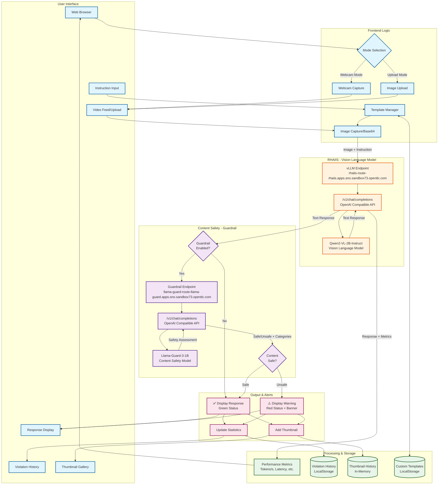
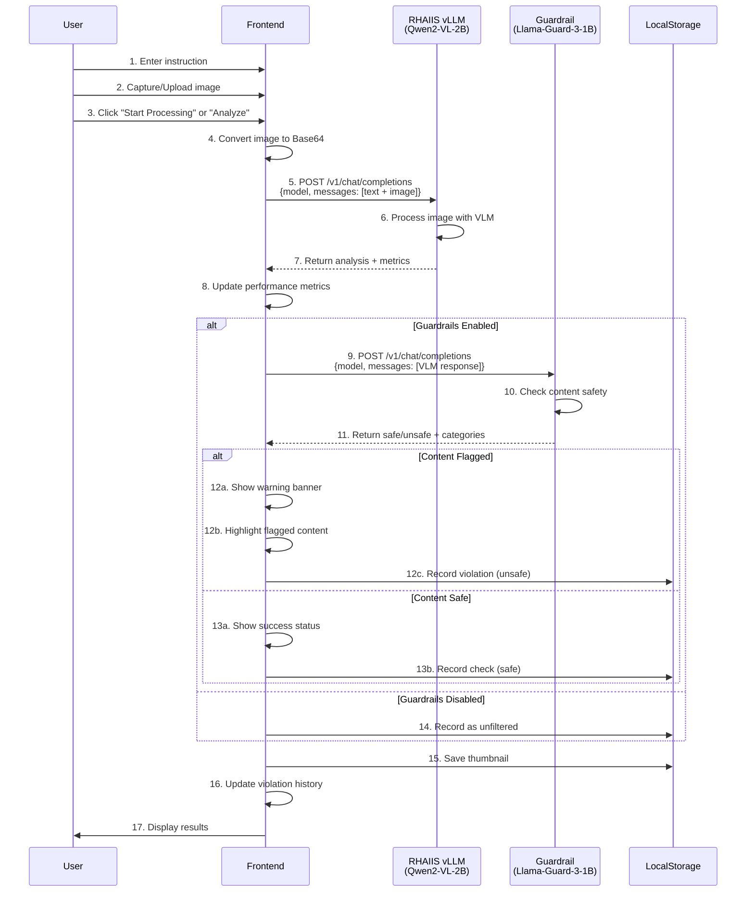

# Vision Language Model (VLM) Demo Architecture

## System Overview
This application provides a real-time vision analysis system with content safety guardrails, powered by Red Hat AI Inference Server (RHAIIS).

## Architecture Diagram



## Component Details

### Frontend Components

| Component | Description |
|-----------|-------------|
| **Web Browser** | Single-page HTML application with embedded JavaScript |
| **Video Feed/Upload** | Dual-mode: Live webcam capture or static image upload |
| **Instruction Input** | User prompt with pre-built templates (security, safety, gestures, etc.) |
| **Response Display** | Shows VLM analysis with syntax highlighting for flagged content |
| **Violation History** | Tracks all safety checks with statistics and detailed logs |
| **Thumbnail Gallery** | Visual history of processed images (max 60) |

### Backend Services

#### Vision Language Model (VLM)
- **Endpoint**: `rhaiis-route-rhaiis.apps.sno.sandbox73.opentlc.com`
- **Model**: Qwen2-VL-2B-Instruct (2 billion parameters)
- **API**: OpenAI-compatible `/v1/chat/completions`
- **Function**: Analyzes images based on user instructions
- **Input**: Base64-encoded image + text prompt
- **Output**: Natural language description/analysis

#### Content Guardrail
- **Endpoint**: `llama-guard-route-llama-guard.apps.sno.sandbox73.opentlc.com`
- **Model**: Llama-Guard-3-1B (1 billion parameters)
- **API**: OpenAI-compatible `/v1/chat/completions`
- **Function**: Detects inappropriate/harmful content
- **Categories**: 15 safety categories (S1-S15)
  - S1: Violent Crimes
  - S2: Non-Violent Crimes
  - S3: Sex-Related Crimes
  - S4: Child Safety
  - S5: Defamation
  - S15: Profanity and Offensive Gestures
  - ...and more
- **Output**: `safe` or `unsafe` + flagged categories

### Data Storage

| Storage | Type | Purpose |
|---------|------|---------|
| **Violation History** | LocalStorage | Persistent safety check records |
| **Thumbnail History** | In-Memory | Recent processed images (60 max) |
| **Custom Templates** | LocalStorage | User-defined instruction templates |

### Performance Metrics

The system tracks real-time performance:
- **Latency**: Time from request to response (ms)
- **Tokens/Second**: Generation speed
- **Prompt Tokens**: Input token count
- **Completion Tokens**: Output token count
- **Total Tokens**: Sum of input and output
- **Throughput**: Overall tokens per second

## Workflow Sequence



## Data Flow

```mermaid
flowchart LR
    subgraph Input
        IMG[Image<br/>640x480 JPEG]
        TXT[Instruction Text<br/>e.g., "Describe scene"]
    end
    
    subgraph Encoding
        B64[Base64 Encoder]
    end
    
    subgraph VLM Processing
        API1[VLM API Request]
        MODEL1[Qwen2-VL-2B<br/>Vision Analysis]
        RESP1[Text Response<br/>+<br/>Usage Metrics]
    end
    
    subgraph Safety Check
        API2[Guardrail API Request]
        MODEL2[Llama-Guard-3-1B<br/>Safety Classification]
        RESP2[Safe/Unsafe<br/>+<br/>Categories]
    end
    
    subgraph Output
        UI1[Display Response]
        UI2[Show Warnings]
        DB1[Store History]
        DB2[Store Thumbnail]
    end
    
    IMG --> B64
    TXT --> API1
    B64 --> API1
    API1 --> MODEL1
    MODEL1 --> RESP1
    RESP1 --> API2
    API2 --> MODEL2
    MODEL2 --> RESP2
    
    RESP1 --> UI1
    RESP2 --> UI1
    RESP2 --> UI2
    RESP1 --> DB1
    RESP2 --> DB1
    B64 --> DB2
    
    style MODEL1 fill:#ff9800
    style MODEL2 fill:#9c27b0
    style RESP2 fill:#f44336
```

## Key Features

### 1. Dual Input Modes
- **Webcam Mode**: Real-time continuous processing at configurable intervals (1-30 seconds)
- **Upload Mode**: One-time analysis of static images

### 2. Intelligent Templating
- Pre-built templates for common use cases:
  - General monitoring
  - Security monitoring
  - People counting
  - Activity detection
  - Gesture detection (with profanity detection)
  - Safety compliance
  - Traffic monitoring
- Custom template creation and management

### 3. Content Safety System
- Multi-layered detection:
  - Primary: Llama-Guard-3-1B model
  - Secondary: Keyword-based fallback
  - Keyword override for missed gestures
- 15 safety categories
- Confidence scoring
- Detailed violation tracking

### 4. Performance Monitoring
- Real-time metrics display
- Token usage tracking
- Latency measurement
- Throughput calculation

### 5. History & Analytics
- Comprehensive violation history table
- Safe/Flagged/Total statistics
- Thumbnail gallery with visual indicators
- Exportable data (via browser storage)

## Technology Stack

- **Frontend**: HTML5, CSS3, JavaScript (Vanilla)
- **Video Capture**: WebRTC MediaDevices API
- **Image Processing**: HTML5 Canvas API
- **Storage**: LocalStorage API
- **Styling**: Custom CSS with CSS Variables (light/dark themes)
- **Icons**: Font Awesome 6.4.0
- **Fonts**: Inter (Google Fonts)

## API Endpoints

### VLM Endpoint
```http
POST https://rhaiis-route-rhaiis.apps.sno.sandbox73.opentlc.com/v1/chat/completions
Content-Type: application/json

{
  "model": "Qwen/Qwen2-VL-2B-Instruct",
  "max_tokens": 150,
  "temperature": 0.3,
  "messages": [
    {
      "role": "user",
      "content": [
        { "type": "text", "text": "Describe what you see" },
        { "type": "image_url", "image_url": { "url": "data:image/jpeg;base64,..." } }
      ]
    }
  ]
}
```

### Guardrail Endpoint
```http
POST https://llama-guard-route-llama-guard.apps.sno.sandbox73.opentlc.com/v1/chat/completions
Content-Type: application/json

{
  "model": "meta-llama/Llama-Guard-3-1B",
  "max_tokens": 100,
  "temperature": 0.0,
  "messages": [
    {
      "role": "user",
      "content": "Task: Check if there is unsafe content...\n<BEGIN CONVERSATION>\nUser: [VLM response]\n<END CONVERSATION>"
    }
  ]
}
```

## Security Considerations

1. **CORS**: Endpoints must support cross-origin requests
2. **API Keys**: Optional authentication via Bearer tokens
3. **Client-Side Storage**: Sensitive data stored only in browser LocalStorage
4. **No Server**: Pure client-side application (no backend server)
5. **Content Filtering**: Two-tier safety system (model + fallback)

## Deployment

- **Platform**: OpenShift Container Platform
- **Routes**: External routes exposed for both services
- **GPU**: NVIDIA GPU operator with time-slicing for efficient resource sharing
- **High Availability**: Service-level load balancing

## Performance Characteristics

- **VLM Latency**: ~2-5 seconds per image (depending on complexity)
- **Guardrail Latency**: ~500ms-1s per check
- **Total Processing Time**: ~3-6 seconds per image (with guardrails)
- **Throughput**: ~10-20 tokens/second (Qwen2-VL-2B)
- **Memory**: ~60 thumbnails max to prevent browser memory issues

## Future Enhancements

- [ ] Video file upload and frame-by-frame analysis
- [ ] Batch processing of multiple images
- [ ] Export violation history to CSV/JSON
- [ ] WebSocket streaming for real-time updates
- [ ] Multi-model comparison (A/B testing)
- [ ] Custom guardrail category definitions
- [ ] Integration with alerting systems
- [ ] Mobile-responsive optimizations

